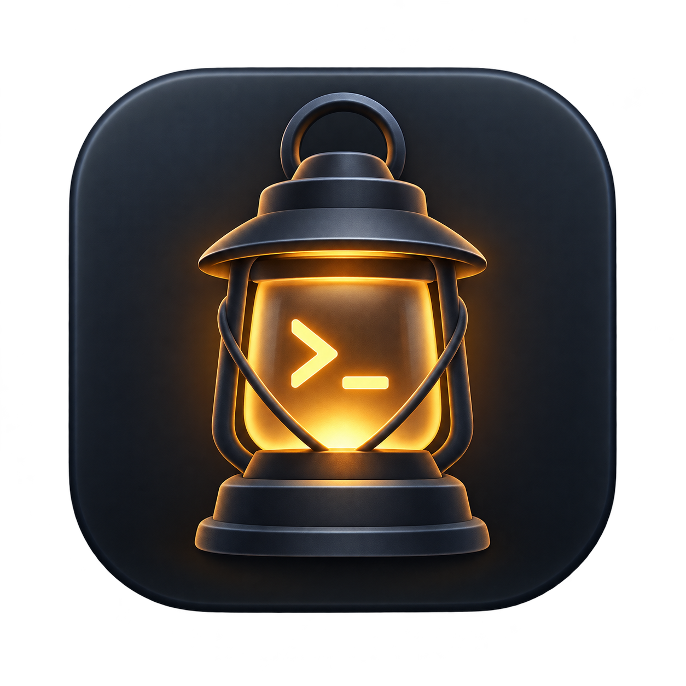
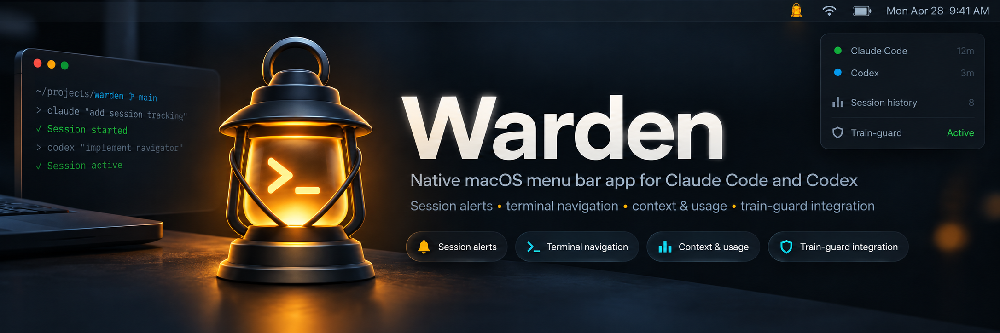

  
  <h1>Warden</h1>
  
Your Claude Code and Codex sessions, in the macOS menu bar.

  

    <a href="https://github.com/fus3r/warden/releases"><strong>Download for macOS</strong></a> ·
    <a href="https://warden.readthedocs.io/en/latest/">Documentation</a> ·
    <a href="CHANGELOG.md">Changelog</a>
  

  
macOS 14+ · Apple silicon and Intel · <a href="LICENSE">MIT</a>

Product illustration. <a href="https://warden.readthedocs.io/en/latest/guide/sessions/">See the native menu →</a>

## Features

- **Know when you're needed.** Get alerts for approvals, questions, failures and completed turns. Answer supported prompts from the menu.
- **Return to your session.** Open the right terminal or resume where you left off.
- **Follow remote agents.** Monitor Linux sessions over SSH from your Mac, and return to their existing tmux panes. [SSH setup](docs/guide/remote-ssh.md).
- **Follow context and usage.** Check quotas, reset readings, local history and work planning. Sources and estimates are clearly labeled.
- **Supervise long jobs.** Built-in [train-guard](https://github.com/fus3r/train-guard) pauses supervised jobs on battery and lowers their priority when the battery is warm.

Optional extras: [Keep Awake](https://warden.readthedocs.io/en/latest/guide/power/), [local phone access](https://warden.readthedocs.io/en/latest/guide/phone/) and [widgets](https://warden.readthedocs.io/en/latest/guide/sessions/#widgets).

History stays on your Mac. Optional SSH monitoring brings filtered remote states and counters to the same menu. Warden does not read provider credentials. [Sources and privacy →](https://warden.readthedocs.io/en/latest/reference/privacy/)

## Install

1. Download the **Warden DMG** from [Releases](https://github.com/fus3r/warden/releases).
2. Drag Warden into Applications and open it.
3. Follow the interactive guide from the lantern in your menu bar.

No Python or Xcode installation is needed. **This beta is not yet notarized**; macOS may require **Privacy & Security → Open Anyway**. See the [installation guide](https://warden.readthedocs.io/en/latest/getting-started/).

## Contributing

[Report a bug](https://github.com/fus3r/warden/issues/new?template=bug.yml) or see the [development guide](https://warden.readthedocs.io/en/latest/development/) to build, test and contribute.

[MIT license](LICENSE). Bundled sounds and dependencies retain their [own licenses and credits](NOTICE.md).
