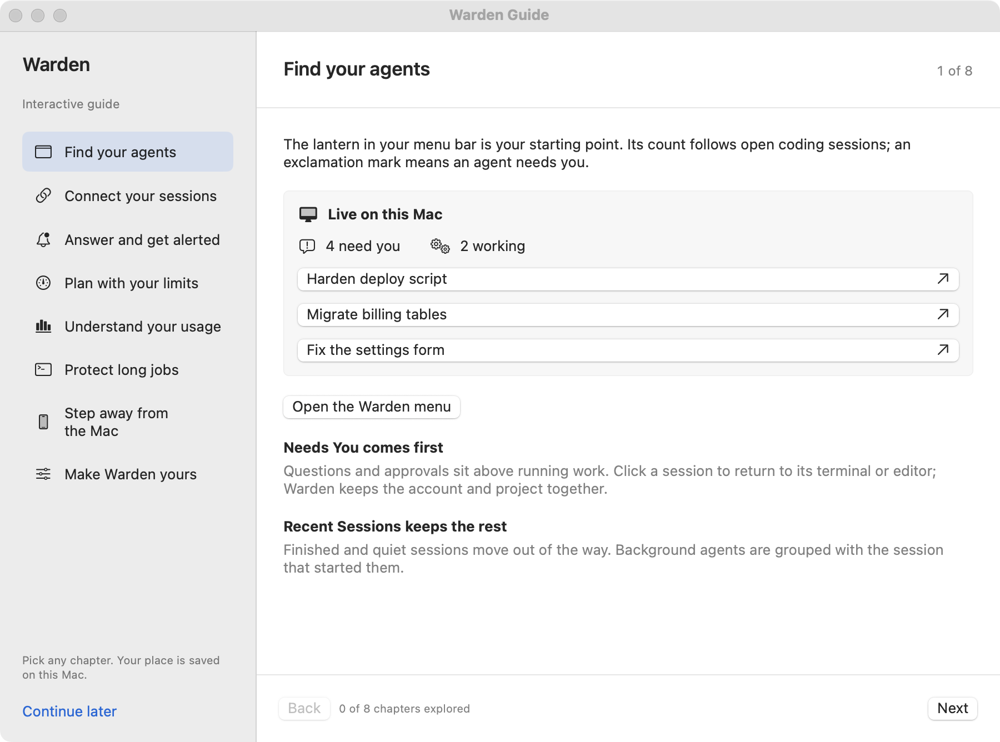

# Install Warden

Install the app, open the lantern menu, and follow the built-in guide. Warden requires **macOS 14 or later**, on Apple silicon or Intel.

## Install on your Mac

1. Download the **Warden DMG** from [GitHub Releases](https://github.com/fus3r/warden/releases).
2. Open the DMG and drag **Warden** into **Applications**.
3. Open Warden. Look for the lantern in your menu bar.

The ZIP is an alternative to the DMG. Both contain the app and its train-guard runtime. No Python, Xcode, or personal server is needed.

### First launch of this beta

This beta is not notarized by Apple. If macOS says it cannot verify the developer or check the app for malicious software, dismiss that message. For the copy downloaded from the official release, go to **System Settings → Privacy & Security → Open Anyway**, then confirm Warden. Follow [Apple's instructions](https://support.apple.com/102445).

Do not disable Gatekeeper or remove quarantine in Terminal. If macOS says the app is damaged or will damage your computer, stop installing and [report the message](https://github.com/fus3r/warden/issues).

## Follow the interactive guide

The guide opens on a fresh installation. Reopen it with **Interactive Guide…** in the menu or **Settings → Setup**. Progress is saved, and you can explore chapters in any order. The practice approval never executes a command.

<figure markdown="span">

<figcaption>The built-in guide walks through the app. Sessions shown here are sample data.</figcaption>
</figure>

## Connect your first session

1. Start Claude Code or Codex in your usual terminal.
2. For Claude Code, choose **Connect…** in the guide. Warden previews the changes and backs up existing settings. Codex monitoring needs no configuration.
3. Check that the session appears in the lantern menu. Click it to return to its terminal.
4. Choose notifications in **Settings → Setup** and try the test. macOS Focus and alert settings still determine whether a banner appears.

See [Connect your sessions](guide/connections.md) for multiple accounts and the optional VS Code companion.

<figure class="warden-settings-shot" markdown="span">

<figcaption>Setup brings connections, notification permission, and startup choices together. Preview state shown here.</figcaption>
</figure>

## Choose the extras you need

| If you want to… | Set up… |
| --- | --- |
| Supervise long local jobs | [train-guard](guide/train-guard.md) |
| Prevent sleep during work | [Keep Awake](guide/power.md) |
| Answer from a phone on the same network | [Phone access](guide/phone.md) |
| Change sounds, quiet hours, or shortcuts | [Notifications and sounds](guide/notifications.md) |

Each is optional. Start with a coding session and add the extras when you need them.

## Update or uninstall

To update, quit Warden, replace the app in Applications, then reopen it. Settings and history are retained.

Before uninstalling:

1. Disconnect Claude Code and turn off **Open at Login**.
2. If enabled, disable the closed-lid service in **Settings → Power**.
3. To remove Warden's train-guard installation, wait for supervised jobs to finish and choose **Remove…** in Settings. It can also remain installed separately.
4. Remove Warden.app and the optional VS Code companion.

See [Data locations](reference/privacy.md#data-locations) to remove collected data.

**Next:** [Connect your sessions →](guide/connections.md)
