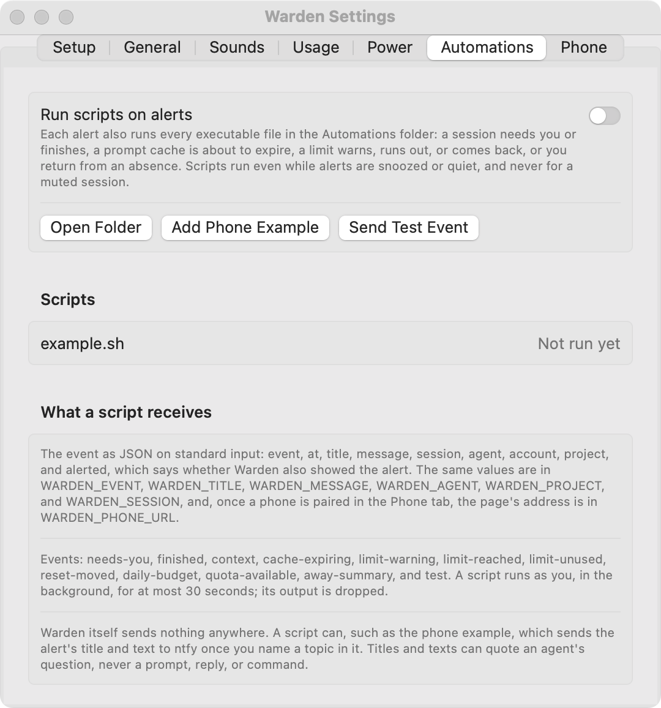

# Run scripts on alerts

Automations let your own executable scripts react to Warden events, for example by keeping a log or sending a phone notification.

<figure class="warden-settings-shot" markdown="span">
[](../assets/screenshots/settings-automations.png)
<figcaption>Automations with a sample script in the preview. Scripts are off, and the example has not been run.</figcaption>
</figure>

## Enable scripts

1. Turn on **Run scripts on alerts** in **Settings → Automations**.
2. Put executable files in `~/Library/Application Support/Warden/Automations`.
3. Use **Send Test Event** to run each script once and inspect its result.

Every script runs in the background, once per event, for at most 30 seconds. Its latest runs stay in memory.

## Event format

The event arrives as JSON on standard input:

```json
{
  "event": "needs-you",
  "at": "2026-09-26T12:24:23Z",
  "title": "Claude · api: Migrate billing tables",
  "message": "Waiting for approval to use Bash",
  "agent": "Claude",
  "project": "/Users/me/api",
  "session": "example-session",
  "alerted": false
}
```

`alerted` says whether Warden also showed the alert. Scripts receive enabled events during snooze, quiet hours, or Only When Needed mode, but a muted session sends nothing.

| Environment variable | Value |
| --- | --- |
| `WARDEN_EVENT` | Event type |
| `WARDEN_TITLE` | Alert title |
| `WARDEN_MESSAGE` | Alert text |
| `WARDEN_AGENT` | Provider name |
| `WARDEN_PROJECT` | Project folder |
| `WARDEN_SESSION` | Session ID |
| `WARDEN_PHONE_URL` | Paired phone page address, when available |

Event types are `needs-you`, `finished`, `context`, `cache-expiring`, `limit-warning`, `limit-reached`, `limit-unused`, `reset-moved`, `daily-budget`, `quota-available`, `away-summary`, and `test`.

## Phone notification example

**Add Phone Example** writes `notify-phone.sh`. Enter a topic in that script to send alerts to the [ntfy](https://ntfy.sh) app. If a phone is paired, tapping its notification can open Warden's phone page.

Automation scripts can send their event content to services you choose. Titles and messages can include a session title or question; approval alerts name the tool, without its command or file. Review the script and destination before enabling it. A phone page address may grant access to private session information and should not be shared publicly.

The relay's built-in generic push notifications are separate from these scripts. See [Phone access](phone.md).

**Related:** [Notifications and sounds](notifications.md) · [Optional network access](../reference/privacy.md#optional-network-access)
