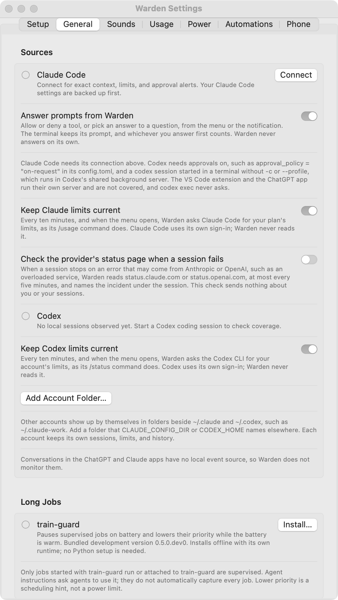

# Connect your sessions

Warden discovers local Claude Code and Codex sessions. Connect Claude Code for exact context readings and approval buttons; add the VS Code companion for precise terminal selection.

For agents running on a Linux server, use **Settings → SSH**. See [Remote agents over SSH](remote-ssh.md) for key authentication, tmux navigation and clusters.

<figure class="warden-settings-shot" markdown="span">
[](../assets/screenshots/settings-general.png)
<figcaption>General contains connections, prompt answering, and account usage reads. The preview has not connected Claude Code.</figcaption>
</figure>

## Claude Code

1. Start a Claude Code session in your usual terminal or editor.
2. Choose **Connect Claude Code** in Warden's menu, Settings, or interactive guide.
3. Review the proposed changes, then connect.
4. Send a prompt in Claude Code and check that Warden shows the session.

Warden adds a status line and lifecycle hooks to the account's `settings.json`. It preserves unrelated settings and an existing custom status line: the bridge runs your command with the same input and prints its output.

Before changing the file, Warden saves the original as `settings.warden-backup.json` and the state before each change as `settings.warden-previous.json`. For the default account, these live in `~/.claude/`.

**Disconnect** removes Warden's hooks and restores the custom status line. If the app moves or Claude Code gains new hook events, the menu can offer to repair the connection. Warden adds only events supported by the installed Claude Code version.

The bridge records context, limit readings, event types, session titles, and process/terminal identifiers. It does not store prompts or replies. Approval records keep only the tool name; failure records keep only the error type.

While Claude Code runs, Warden also reads its documented `claude agents --json` status once a minute and when you open the menu. This adds live process information and waits that hooks or transcripts may not show, such as a sandbox request or open dialog.

## Codex

Start Codex as usual. Warden reads recent session logs under `$CODEX_HOME/sessions` or `~/.codex/sessions`, and thread names from `session_index.jsonl`. It preserves an existing `notify` command.

Context is estimated from the last input token count and logged capacity. Spawned threads and reviews are grouped with the session that started them.

Monitoring and answering have different coverage: [Approvals and questions](prompts.md#codex) explains the shared terminal server and sessions whose prompts stay in their own window.

## VS Code companion

The optional companion selects the exact integrated terminal and window, including terminals in editor tabs and windows for other projects.

1. Download **`warden-terminal.vsix`** from [Warden Releases](https://github.com/fus3r/warden/releases).
2. In VS Code, choose **Extensions → … → Install from VSIX…**.
3. If VS Code requests a reload, wait until your sessions can be interrupted.
4. Click a live session in Warden and check that its terminal comes forward.

Without the companion, Warden activates the live host app. From a source checkout, `./Scripts/install-editor-extension.sh` installs it.

## Several accounts

Warden discovers account folders beside the defaults, such as `~/.claude-work` and `~/.codex-personal`, when they hold session logs. Use **Settings → General → Add Account Folder…** for folders elsewhere, including those selected with `CLAUDE_CONFIG_DIR` or `CODEX_HOME`.

Each account keeps its own sessions, limits, history, and Claude Code connection. Named accounts prefix their limits, such as **work 5h**. Connecting one Claude account changes only that account's settings file.

## Scripts and status bars

The helper at `Warden.app/Contents/Helpers/WardenBridge` provides a compact summary:

```sh
/Applications/Warden.app/Contents/Helpers/WardenBridge status
/Applications/Warden.app/Contents/Helpers/WardenBridge status --json
```

It reads counts and limits only; session titles and folders stay in the app. For scripts that react to events, see [Automations](automations.md).

**Next:** [Sessions and the menu →](sessions.md)
