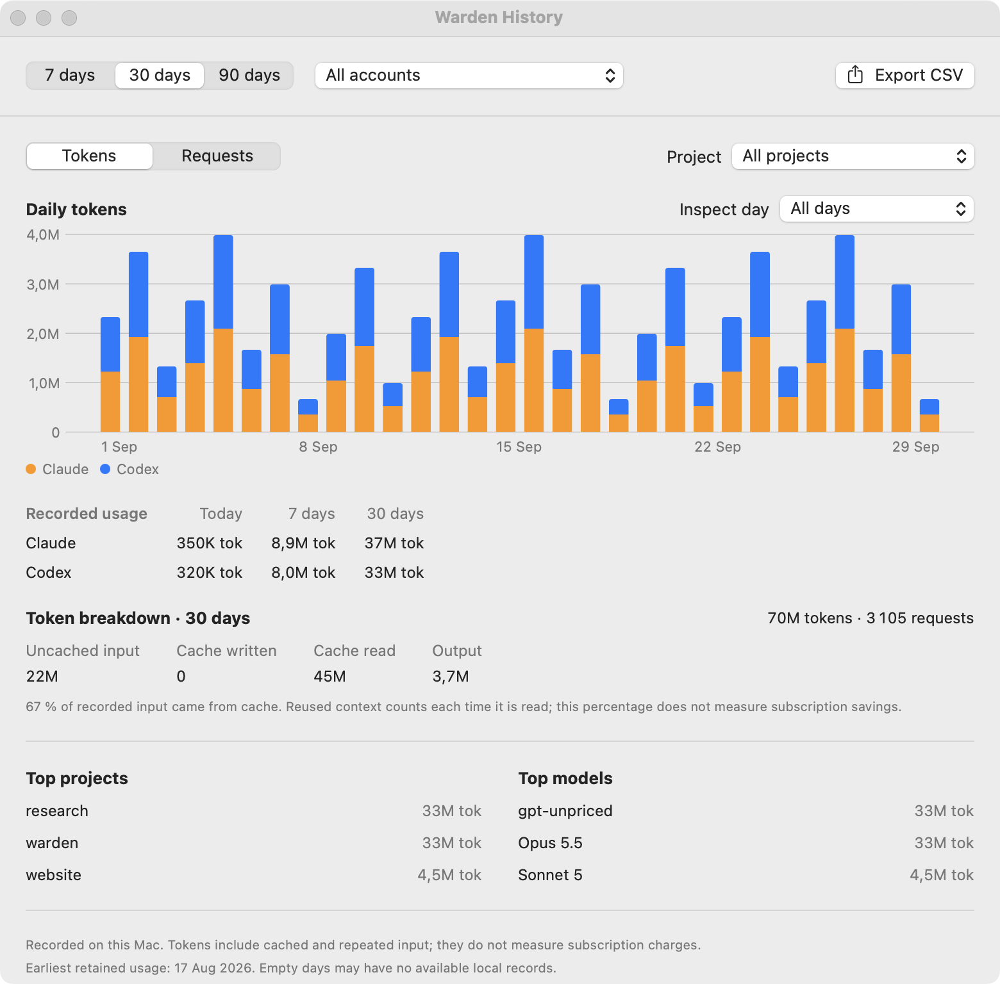
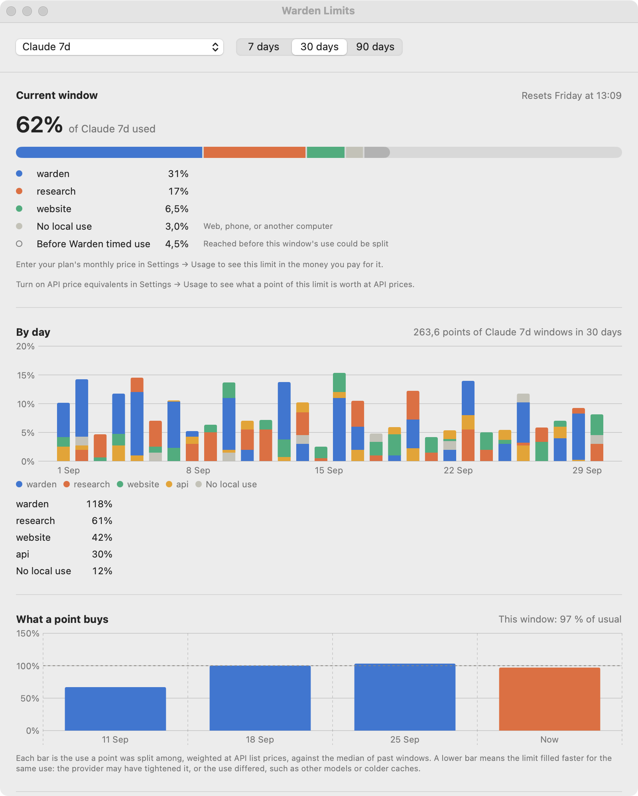
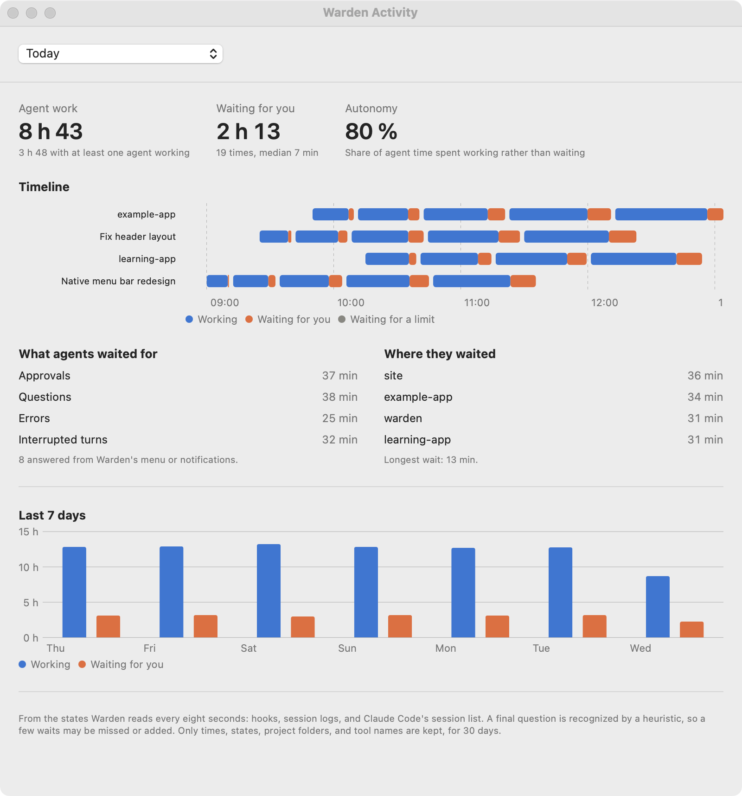
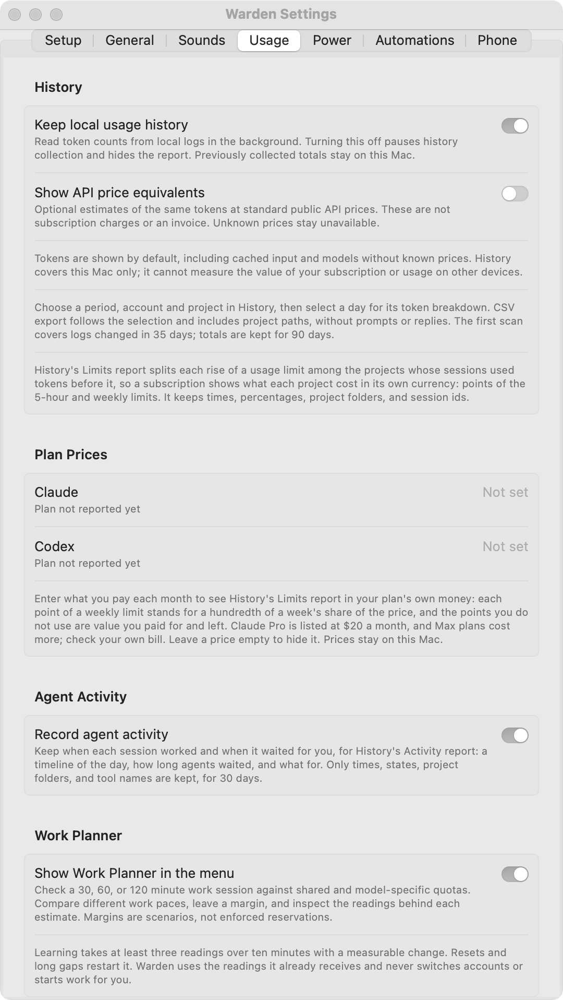

# History and reports

Open **History** from the menu. Its three reports answer different questions: how many tokens were used, where quota went, and when agents worked or waited.

## Usage

<figure markdown="span">

<figcaption>Usage report with sample data. Tokens are the default metric.</figcaption>
</figure>

1. Choose **7, 30, or 90 days** and an account.
2. Compare tokens or requests, then filter by project if needed.
3. Select a day to inspect input, cache writes, cache reads, and output.
4. Export the current selection to CSV. Rankings and export follow the selection.

The cache percentage uses recorded input; it does not measure subscription savings. Missing days may have no available records. The initial read includes logs changed in the last five weeks; collected totals are retained for 90 days, even if the provider later removes a log.

!!! note "API price equivalents are optional"
    Enable them in **Settings → Usage** to compare recorded tokens at public API prices. These amounts are estimates, not subscription charges or an invoice. Unknown prices remain unavailable; partial amounts identify what they exclude.

## Limits

<figure markdown="span">

<figcaption>The top of the Limits report, with sample quota allocation. The provider reports the account total; project shares are estimates.</figcaption>
</figure>

Limits tracks each 5-hour, weekly, and model window. When the reported percentage rises, Warden splits that rise among sessions with recorded token use since the previous reading, weighted by API list prices. This approximates how the plan was used; providers report only an account total.

A rise with no local use stays visible as **No local use**, which can include activity on the web, phone, or another computer. The report shows project shares, points per day, and past windows. Session tooltips show their estimated share of current windows.

If you enter your monthly plan price in **Settings → Usage**, each weekly point represents a hundredth of a week's share of that price. The report can express allocation in your plan's currency and show unused weekly value. Five-hour and model limits have no separate plan price.

The **What a point buys** chart compares the current window with the median of past windows, using API list prices to weight recorded use. A change can reflect different usage or provider metering; it does not establish that the provider changed its policy.

## Activity

<figure markdown="span">

<figcaption>Sample activity spans, separate from token and quota accounting.</figcaption>
</figure>

Activity shows working time, waits for your answer, and waits for quota. It includes median response time, answers from Warden, the share of agent time spent working, and a seven-day comparison.

Activity spans are retained for 30 days. This report follows local observations and cannot measure activity on other devices.

## Control recording and exports

**Settings → Usage** can pause usage history or turn activity recording off. Previously collected totals stay on your Mac. See [Data locations](../reference/privacy.md#data-locations) for removal and retention.

<figure class="warden-settings-shot" markdown="span">

<figcaption>Usage controls recording, optional price estimates, and Work Planner visibility. Plan prices are empty in this preview.</figcaption>
</figure>

CSV exports can contain full project paths. Review them before sharing a report.

**Next:** [Work Planner →](planner.md)
