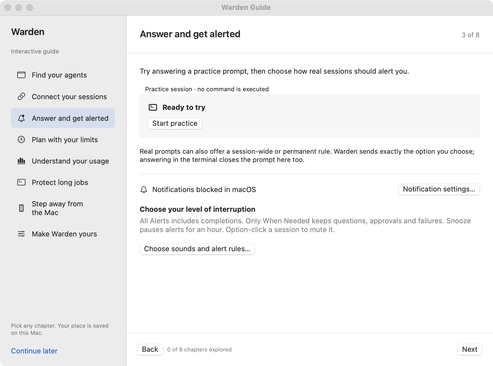
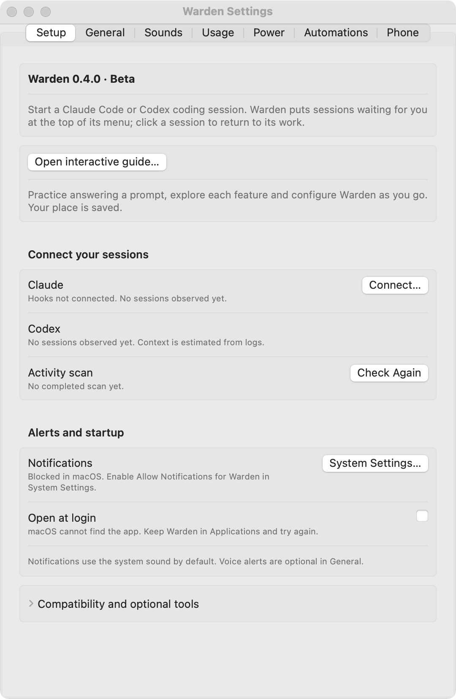
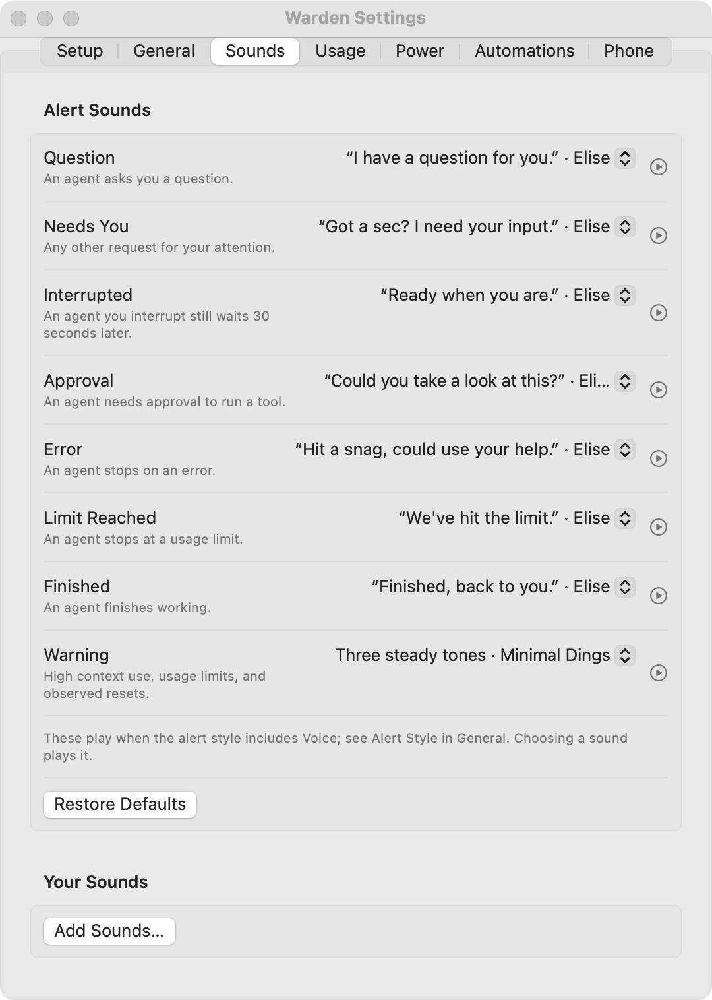

# Notifications and sounds

Choose how Warden interrupts you in **Settings → General**, then check macOS notification delivery in **Settings → Setup**.

<figure markdown="span">

<figcaption>Try an approval and explore notifications in the built-in guide. The practice command is never executed.</figcaption>
</figure>

## Setup and permissions

Setup shows notification permission, whether banners are allowed, login-item registration and pending approval, the optional power service, and local source coverage. Checking these states does not request a permission.

1. Allow Warden notifications from Setup if you want banners.
2. Use the notification test.
3. If no banner appears, check **System Settings → Notifications → Warden**, its alert style, and **Focus**.

A submitted test confirms submission only; macOS decides whether to display it. **Open at Login** is optional. Existing installations retain their login and alert choices.

<figure class="warden-settings-shot" markdown="span">

<figcaption>Check delivery permission in Setup before testing a notification. The screenshot shows the preview's macOS permission state.</figcaption>
</figure>

## Choose when to interrupt

| Menu choice | Behavior |
| --- | --- |
| **All Alerts** | Includes turn completions and enabled warnings |
| **Only When Needed** | Keeps alerts for sessions that need you |
| **Snooze** | Pauses alerts for one hour |
| **Alerts by Session** | Chooses a style for a particular session |

Hold Option while clicking a session to mute its alerts. A session follows its agent's default style until you choose another.

General settings control quiet hours, context and quota warnings, the away summary, and whether to stay quiet when a session's Terminal or iTerm tab is already in front.

The default style uses a notification with the system sound. Voice lines are optional. With microphone suppression enabled, voice and alert sounds stay silent during microphone use, such as a call. Warden reads only whether a microphone is in use; it does not record audio.

## Keyboard shortcuts and menu choices

Global shortcuts are off by default. Enable one to open the menu and another to bring forward the session that has waited longest. They use macOS's hot key service and need no Accessibility permission.

Settings can hide the menu's usage, recent-session, or alert sections. They can also add a current quota percentage beside the lantern.

## Sounds and credits

In **Settings → Sounds**, choose and preview a sound for questions, approvals, interruptions, errors, limits, completions, and warnings. **Add Sounds** copies your own audio into `~/Library/Application Support/Warden/Sounds`.

<figure class="warden-settings-shot" markdown="span">

<figcaption>Choose each alert's sound, preview it, or add your own files in Sounds.</figcaption>
</figure>

The bank includes 61 clips from these redistributable packs:

| Pack | Credit and license |
| --- | --- |
| [Elise](https://github.com/utensils/openpeon-elise-soundpack) | Doomspork / Utensils, generated with ElevenLabs; [CC BY 4.0](https://creativecommons.org/licenses/by/4.0/) |
| Voiceover Pack | Kenney, voiced by Giselle and Jeffrey M. Smith; CC0 |
| Announcer clips | Recorded and performed by Aimee Smith; CC BY 4.0 |
| [minimal-dings](https://github.com/iain/minimal-dings) | iain; CC0 |

Clips are mixed to mono, matched in loudness, and converted to AAC. [The full credits](https://github.com/fus3r/warden/blob/main/Resources/Voice/CREDITS.md) list every file.

**Related:** [Automations](automations.md) · [Missing notifications](../reference/troubleshooting.md#notifications-do-not-appear)
