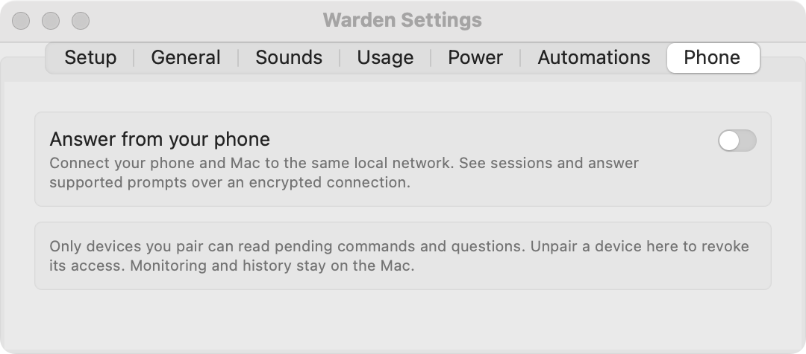

# Answer from your phone

A paired phone shows waiting prompts, working sessions, and limits. It offers the same supported answers as the Mac; the terminal keeps its prompt until one view answers.

!!! info "Phone access in this beta"
    The downloadable beta uses the **same local network**. The Mac must stay awake. A hosted relay is not included; the relay source is available for self-hosting.

## Pair on the local network

Open **Settings → Phone**. Keep the Mac and phone on the same Wi-Fi or Ethernet network.

<figure class="warden-settings-shot" markdown="span">

<figcaption>Start in Phone settings. Phone access is off in this preview; enabling it reveals the profile and pairing controls.</figcaption>
</figure>

1. Turn on **Answer from your phone**.
2. Choose **Send with AirDrop…** or **Save Profile…** to give the phone Warden's HTTPS profile.
3. On iPhone, install it in **Settings → Profile Downloaded**. Then enable trust for **Warden on [your Mac]** in **Settings → General → About → Certificate Trust Settings**. Compare the profile fingerprint with Warden's settings.
4. Choose **Pair a Phone…** and scan the QR code with the phone's camera.
5. To use it like an app, add it to the Home Screen from Safari's Share menu. Pair again inside the Home Screen app using the six-digit code: it keeps its own cookies.

Pairing expires after five minutes, works once, and closes after five wrong attempts. Check [Keep Awake](power.md) before leaving the keyboard; use an open lid for your first test.

## Local HTTPS and privacy

The profile contains a root certificate for this Mac's local name. Warden discards that root's private key after signing its server certificate, so it cannot sign more certificates. The server certificate lasts 825 days.

**Make New…** creates new certificates; each phone then installs the profile again. A changed Mac local name in Sharing settings also requires renewal.

The phone talks directly to the Mac over HTTPS. Warden listens only while the feature is enabled and a phone is paired or pairing is open, on local Wi-Fi or Ethernet, never through a VPN. Devices outside the local network are refused.

The phone holds a random secret in its cookie; Warden stores its hash. Answers also require the page's origin and header. Prompt content stays in memory and is not saved as phone history.

## Notifications and unpairing

The local page follows changes while open. For separate phone alerts, the optional [automation example](automations.md#phone-notification-example) can send notifications through ntfy.

Choose **Unpair** in Warden Settings or on the phone to revoke that device's access.

## Optional self-hosted relay

Builds configured with a relay offer **Settings → Phone → Anywhere**. They pair with an expiring QR code and work across Wi-Fi and mobile networks without a certificate profile or VPN.

The Mac and phone encrypt session state and replies using per-device keys. The relay forwards opaque packets and keeps routing and push metadata, with no session history. Generic Web Push notices contain no command or question. On iPhone, add the page to the Home Screen and grant notifications there.

See [Relay deployment and privacy boundaries](https://github.com/fus3r/warden/tree/main/Relay) for setup and physical-device checks. Local pairing does not verify mobile-data or locked-screen notification delivery.

**Related:** [Phone troubleshooting](../reference/troubleshooting.md#the-phone-cannot-connect) · [Sources and privacy](../reference/privacy.md#optional-network-access)
