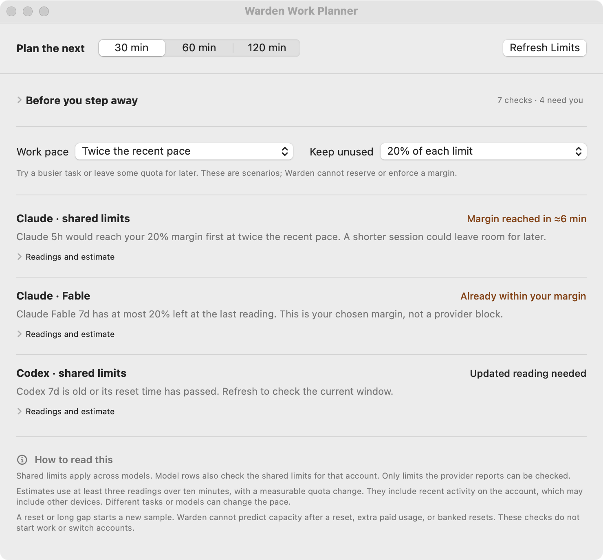

# Work Planner

Open **Work Planner…** from the menu to compare a proposed work period with your current account and model limits.

<figure markdown="span">

<figcaption>Sample readings and projections. A model-specific limit can constrain work before its shared account limit.</figcaption>
</figure>

## Compare a work period

1. Choose **30, 60, or 120 minutes**.
2. Compare **half, recent, or twice the recent pace**.
3. Optionally keep **10% or 20% unused** as a planning margin.
4. Inspect each account/model route, its first projected constraint, and the readings behind it.

Warden distinguishes reaching your chosen margin from reaching a provider limit. The margin is a scenario: it does not reserve or enforce quota.

## Read the evidence

Pace comes from changes in reported usage, not a guess based on session count. An estimate needs at least three readings over ten minutes with a measurable change. Warden learns again after a reset or a long gap and does not project beyond a reset.

Shared account and model-specific windows both constrain a route. Missing or stale readings remain visible rather than becoming a confident prediction.

## Before you step away

Expand **Before you step away** to review:

- Decisions waiting for you and sessions with high context.
- Large quiet caches expiring within the selected period.
- Provider-reported automatic resumes.
- Missing current shared quotas for working accounts.
- Power protection: idle sleep prevention and confirmed closed-lid protection are separate states.

Each session check includes its source and observation time. Refresh an old scan before relying on it. [Keep Awake](power.md) explains the power states.

!!! note "A review, not a completion guarantee"
    The planner does not start jobs, switch accounts, reserve quota, or promise that an unattended task will finish. Use its observations alongside the task's own requirements.

**Related:** [Context and quotas](limits.md) · [train-guard](train-guard.md) · [Phone access](phone.md)
