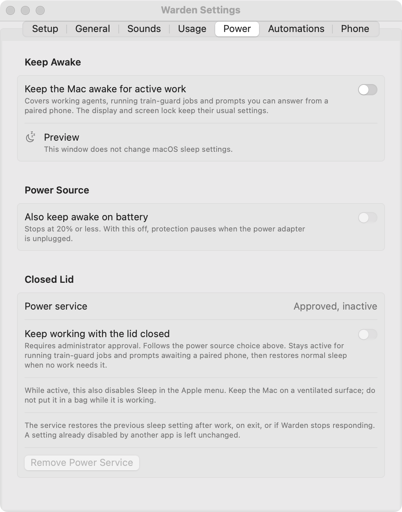

# Keep Awake

Configure **Settings → Power** to keep the Mac available while work needs it. Idle sleep prevention and closed-lid protection are separate options.

<figure class="warden-settings-shot" markdown="span">

<figcaption>Power settings in the preview build. A preview cannot authorize the closed-lid service.</figcaption>
</figure>

## Prevent idle sleep

Turn on **Keep the Mac awake for active work**. Protection covers working coding sessions, running train-guard jobs, and answerable prompts awaiting a paired phone. Normal sleep resumes when they no longer need protection.

The display may turn off and the screen may lock. This option needs no administrator password and does not prevent the sleep caused by closing the lid.

By default, protection uses the power adapter only. Optional battery use stops at **20% or less**. Unknown battery state, critical thermal pressure, and stale activity can also pause protection. The menu's **Keep Awake** submenu shows the current state and offers a toggle.

## Keep working with the lid closed

1. In the signed release app, turn on **Keep working with the lid closed**.
2. Approve Warden in **System Settings → General → Login Items & Extensions** if macOS asks.
3. Check that Warden reports active protection, then test a disposable job on your Mac.

This optional service temporarily applies `pmset -a disablesleep 1`, which also disables **Sleep** in the Apple menu. Use a ventilated surface and keep the Mac out of a bag. An already-disabled system setting is left alone.

Registration, macOS approval, and active protection are separate states. If the service stops confirming protection, Warden stops showing it as active. Preview and ad-hoc builds cannot authorize it.

## Restore normal sleep

Turn protection off, let the work finish, or quit Warden. **Remove Power Service** restores sleep before unregistering the service; a timeout is reported if restoration cannot be confirmed.

Warden renews requests every five seconds. The service checks power, the battery reserve, and critical thermal pressure independently. It restores sleep after disconnection or a request expiry of 25 seconds, checked every five seconds, and recovers an interrupted change on its next launch. A scan older than one minute also pauses protection.

!!! note "Verify closed-lid behavior on your Mac"
    An idle-sleep assertion does not establish closed-lid operation. Check continuation with the lid closed and restoration of normal sleep on the hardware and macOS version you use. The [release device checklist](../releasing.md#device-checks) describes these checks.

**Related:** [Work Planner](planner.md#before-you-step-away) · [Phone access](phone.md)
