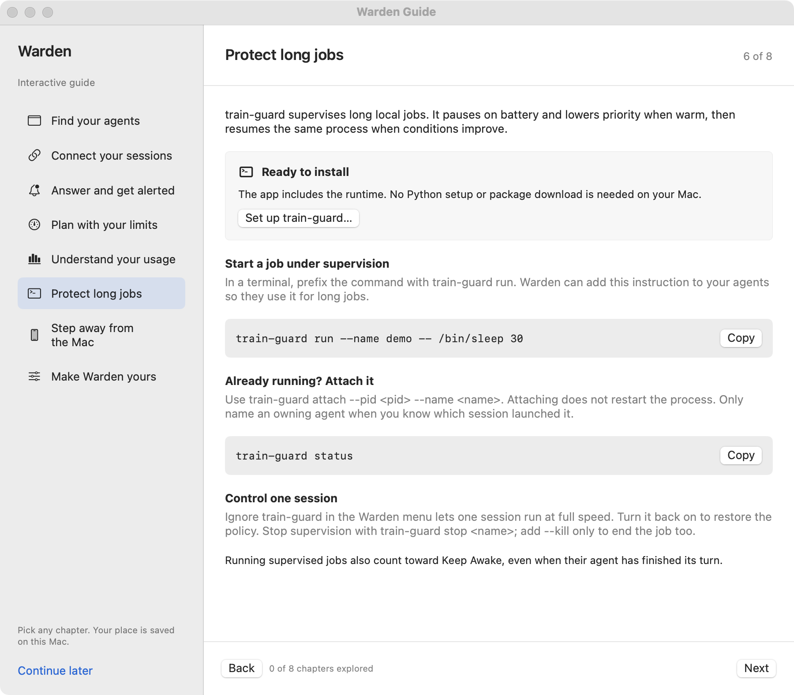

# Supervise long jobs with train-guard

[train-guard](https://github.com/fus3r/train-guard) pauses supervised jobs on battery and lowers their priority when the battery is warm. When conditions improve, the same process continues.

<figure markdown="span">
[](../assets/screenshots/train-guard.png)
<figcaption>The built-in guide explains supervision without starting a job.</figcaption>
</figure>

## Install from Warden

Choose **Settings → General → Long Jobs** and install the bundled runtime. This beta includes train-guard **0.5.0.dev0**; no Python installation or dependency download is needed.

Warden verifies payload files against a SHA-256 manifest. Installation uses a separate folder under `~/.local/share/train-guard` and a command link in `~/.local/bin`. Open a new terminal after installing. Existing policy is preserved, and active guards block updates or removal.

## Try a disposable job

```sh
train-guard run --name warden-test -- /bin/sleep 30
train-guard status
```

On battery, the job may stay paused until power is reconnected. To end the test:

```sh
train-guard stop warden-test --kill
```

For a real computation, put its command after `--`. Attach an already-running job with `train-guard attach --pid <pid> --name <job>`. Attaching does not establish which agent launched it: use `--agent <session-id>` only when the original owner is known.

Only jobs run or attached this way are supervised. Instructions to agents do not intercept other commands. Lower priority is a scheduling hint, not a power cap or a measured battery-life improvement. Keep application checkpoints: pausing does not preserve RAM across a reboot.

## Ask agents to use it

Long Jobs can add instructions to each account's `CLAUDE.md` or Codex `AGENTS.md`. Warden saves a backup before the first edit and marks its section so it can remove only what it added.

A file that already mentions train-guard stays as written. Unreadable text is left alone. Symbolic links stay links, with the section added to the target.

## Allow one session to run at full speed

**Ignore train-guard** in the menu lets you exempt a session's guarded jobs, including on battery. Uncheck it to restore the policy; train-guard applies the change at its next check.

The menu identifies each session's guarded jobs and whether they are paused, at low priority, or running at full speed. Ownership comes from the session ID recorded by `train-guard run`, or an explicit original owner on attach. Warden itself does not start, pause, or resume jobs.

## Migrate or remove

**Migrate…** upgrades a recognized older shell installation only while no legacy guard is active. It preserves the script, logs, persisted jobs, and launch agent. Literal policy values are translated only if no Python policy exists; `ecore` becomes `gentle`. Legacy jobs still belong to the old script and should be managed through its full path.

**Remove…** waits for active guards to finish, removes Warden's package, link, and marked instruction sections, and restores the legacy command when applicable. State and logs in `~/.train-guard` remain. Unrelated commands and unmanaged folders are left alone.

Running guarded jobs also count toward [Keep Awake](power.md), even if their coding agent's turn has finished.
