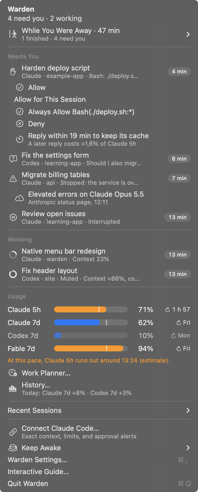

# Warden

Your Claude Code and Codex sessions, in the macOS menu bar.
{ .warden-lead }

See which sessions are working or waiting for you, return to their terminals, and check context and quota readings before starting more work.

**macOS 14+ · Apple silicon and Intel**

[Install Warden](getting-started.md){ .md-button .md-button--primary }
[Download beta](https://github.com/fus3r/warden/releases){ .md-button }

## Find your next step

- **New to Warden?** [Connect your first session](guide/connections.md), then [learn the menu](guide/sessions.md).
- **A session needs you?** [Answer approvals and questions](guide/prompts.md) or [choose your alerts](guide/notifications.md).
- **Planning more work?** [Read your quotas](guide/limits.md), [inspect History](guide/history.md), or [open Work Planner](guide/planner.md).
- **Stepping away?** Set up [train-guard](guide/train-guard.md), [Keep Awake](guide/power.md), and [phone access](guide/phone.md).

[Browse all guides →](usage.md)

<figure class="warden-menu-shot" markdown="span">

<figcaption>The native Warden menu. Sample sessions and readings; click any screenshot to enlarge it.</figcaption>
</figure>

!!! info "About this beta"
    **0.4.0 beta, build 9** adds [remote Linux agents over SSH](guide/remote-ssh.md), alongside the train-guard runtime and local-network phone access. It is not yet notarized by Apple; the [installation guide](getting-started.md#first-launch-of-this-beta) explains first launch. A hosted phone relay is available for self-hosting, and is not included in this beta.

## Local monitoring, visible sources

Monitoring and history stay on your Mac. Warden does not read provider credentials. Readings distinguish provider values, local logs, estimates, and unavailable information. [Sources and privacy](reference/privacy.md) explains what is read, stored, and shared with optional integrations.

Building from source? Start with [Build and contribute](development.md).
